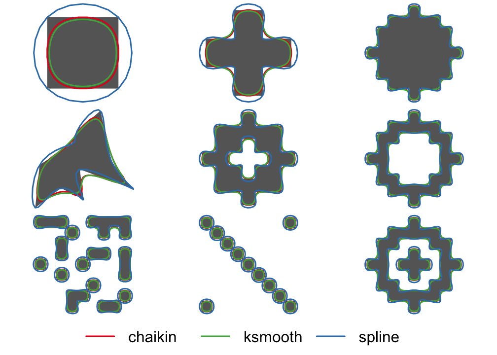

<!-- README.md is generated from README.Rmd. Please edit that file -->
smoothr
=======

[](https://www.tidyverse.org/lifecycle/#experimental) [](http://www.gnu.org/licenses/gpl-3.0) [](https://travis-ci.org/mstrimas/smoothr) [](https://ci.appveyor.com/project/mstrimas/smoothr) [](https://codecov.io/github/mstrimas/smoothr?branch=master) [](https://cran.r-project.org/package=smoothr) [](http://www.r-pkg.org/pkg/smoothr)

The goal of `smoothr` is to offer a variety of methods for smoothing spatial features (i.e. polygons and lines). The application is to to make edges appear more natural or aesthetically pleasing, especially when converting raster data to vector format. This package offers support for both `sp` and `sf` spatial objects, and the following smoothing methods:

-   **Chaikin's corner cutting algorithm**: smoothing using Chaikin's corner cutting algorithm, which iteratively replaces every point by two new points: one 1/4 of the way to the next point and one 1/4 of the way to the previous point.
-   **Spline interpolation**: smoothing using spline interpolation via the `spline()` function. This method interpolates between existing vertices and can be used when the resulting smoothed feature should pass through the vertices of the input feature.

Installation
------------

``` r
# install from cran with
install.packages("smoothr")

# or install the development version from github with
# install.packages("devtools")
devtools::install_github("mstrimas/smoothr")
```

Usage
-----

Two example feature sets are included in this package. `jagged_polygons` contains 9 polygons with sharp edges for smoothing, some have holes and some are multipart polygons. We can smooth these using the different methods available and plot a comparison:

``` r
library(sf)
library(smoothr)
par(mar = c(0, 0, 0, 0), oma = c(4, 0, 0, 0), mfrow = c(3, 3))
p_smooth_spline <- smooth(jagged_polygons, method = "spline")
p_smooth_chaikin <- smooth(jagged_polygons, method = "chaikin")
for (i in 1:nrow(jagged_polygons)) {
  plot(st_geometry(p_smooth_spline[i, ]), col = NA, border = NA)
  plot(st_geometry(jagged_polygons[i, ]), col = "grey40", border = NA, add = TRUE)
  plot(st_geometry(p_smooth_chaikin[i, ]), col = NA, border = "#E41A1C", lwd = 2, add = TRUE)
  plot(st_geometry(p_smooth_spline[i, ]), col = NA, border = "#377EB8", lwd = 2, add = TRUE)
}
par(fig = c(0, 1, 0, 1), oma = c(0, 0, 0, 0), new = TRUE)
plot(0, 0, type = "n", bty = "n", xaxt = "n", yaxt = "n", axes = FALSE)
legend("bottom", legend = c("chaikin", "spline"), col = c("#E41A1C", "#377EB8"),
       lwd = 2, cex = 2, box.lwd = 0, inset = 0, horiz = TRUE)
```



`jagged_lines` contains 9 lines with sharp edges for smoothing, some are closed loops requiring special treatment of the endpoints and some are multipart lines. For variety, let's smooth these using spline interpolation:

``` r
par(mar = c(0, 0, 0, 0), oma = c(4, 0, 0, 0), mfrow = c(3, 3))
l_smooth_spline <- smooth(jagged_lines, method = "spline")
l_smooth_chaikin <- smooth(jagged_lines, method = "chaikin")
for (i in 1:nrow(jagged_lines)) {
  plot(st_geometry(l_smooth_spline[i, ]), col = NA)
  plot(st_geometry(jagged_lines[i, ]), col = "grey20", lwd = 3, add = TRUE)
  plot(st_geometry(l_smooth_spline[i, ]), col = "#E41A1C", lwd = 2, lty = 2, add = TRUE)
  plot(st_geometry(l_smooth_chaikin[i, ]), col = "#377EB8", lwd = 2, lty = 2, add = TRUE)
}
par(fig = c(0, 1, 0, 1), oma = c(0, 0, 0, 0), new = TRUE)
plot(0, 0, type = "n", bty = "n", xaxt = "n", yaxt = "n", axes = FALSE)
legend("bottom", legend = c("chaikin", "spline"), col = c("#E41A1C", "#377EB8"),
       lwd = 2, cex = 2, box.lwd = 0, inset = 0, horiz = TRUE)
```


